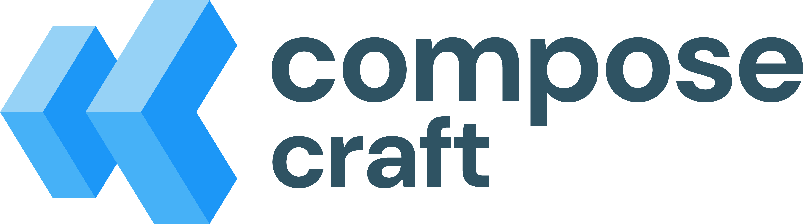
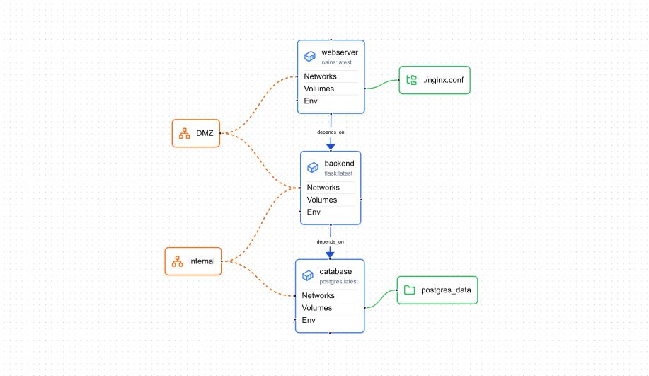
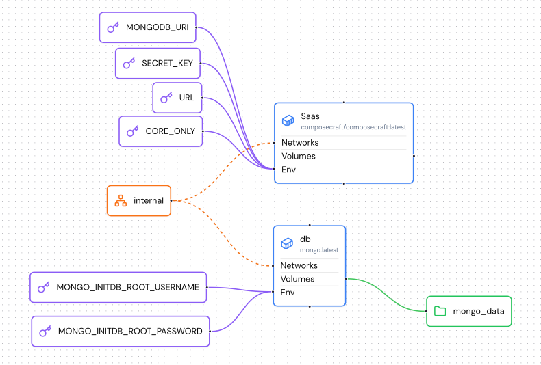

<div style="display: flex; justify-content: center; flex-direction: column;gap:20px; align-items: center">
    <h1>Compose Craft</h1>
    
</div>

[Compose craft](https://composecraft.com) is a tool to help you manage, edit and share docker compose files in a GUI way.



## Features :

- Create docker compose with a GUI
- Share docker compose diagram in one click with a public link
- Import your own docker files
- Export the code

## QuickStart

You can use the online tool under [composecraft.com](https://composecraft.com).

Or SelfHost the tool by yourself.

## Self-Host

If you want to try the tool on your own infra you can use the `docker-compose.yml` file by running :

```bash
docker compose up
```
 Then, the app will be available under http://localhost:3000

Here is a quick view of the stack 😉 : 



> Note: the library and the sign in with github won't work.

## Documentation

The complete doc is available under [https://composecraft.com/docs/](https://composecraft.com/docs/)

The project is built with nextjs Typescript and use react-flow for the nodal GUI.
The database is mongodb.

You can run the project with : (also possible with npm and yarn)

```bash
pnpm install
```

```bash
pnpm run dev
```

> Note: you have to provide a mongodb connection string and a secret key

### Environment variables:

- SECRET_KEY : The key used to sign JWT tokens
- MONGODB_URI : Used to connect to mongodb
- URL : The base url used for some redirect and public link generation
- CORE_ONLY : Disable SaaS hosted features (to allow simple self-host)
- DISABLE_TELEMETRY : Disable telemetry

### Telemetry

By default, the app collect basic website telemetry with as self-hosted instance of [umami](https://umami.is).
But if you want to disable it, you can just set DISABLE_TELEMETRY=true in envs.


